# HUB75 Display Frame

> The model and documentation were developed with the assistance of ChatGPT.

This repository contains the OpenSCAD development of a frame for five HUB75 LED matrix panels.

The design uses a modular OpenSCAD structure with reusable physical components, project-specific derived components and assemblies. Individual parts can be opened, rendered and tuned independently, while the complete construction can be viewed from `main.scad`.

> **Project status:** Concept development  
> V1.0 explored a frame based on 20 × 20 mm aluminium extrusion and is mainly retained as a reference concept. V1.1 explored a modular 3D-printed frame combined with two continuous aluminium tubes. Active development has moved to V1.2, which deliberately reduces the printed structure to direct panel-to-panel couplers so the mechanical strength can be tested before adding more complexity. The V1.2 couplers now use four profile modes: `large`, `medium`, `small` and `custom`; the three named presets are fixed, while `custom` activates individually editable dimensions.

## V1.0

### Inspiration

The aluminium-frame approach in V1.0 was inspired by the Instructables project [**Simple Extruded Aluminum Frame for LED Panels**](https://www.instructables.com/Simple-Extruded-Aluminum-Frame-for-LED-Panels/), created by **NotLikeALeafOnTheWind**.

[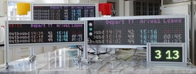](https://www.instructables.com/Simple-Extruded-Aluminum-Frame-for-LED-Panels/)

*Source: [Instructables / NotLikeALeafOnTheWind — Simple Extruded Aluminum Frame for LED Panels](https://www.instructables.com/Simple-Extruded-Aluminum-Frame-for-LED-Panels/). The image is included as a visual reference to the original project. Copyright remains with the original creator.*

### Concept

V1.0 explores an aluminium-extrusion-based structure for supporting the HUB75 panels and the components mounted directly to that structure.

The concept includes:

- a 20 × 20 mm aluminium extrusion frame;
- five HUB75 LED matrix panels;
- panel mounting brackets;
- TS35 DIN rails positioned around the panel seams;
- cable clips and ribbon-cable routing;
- frame-mounted fasteners;
- optional ESP32 mounting;
- optional power-supply mounting.

V1.0 is a concept drawing and is primarily retained as a reference for this construction approach.

The OpenSCAD model is stored in:

```text
v1.0/cad/
```

### Renders

Reference renders generated from the V1.0 OpenSCAD model are stored in:

```text
v1.0/out/png/
```

#### Front view

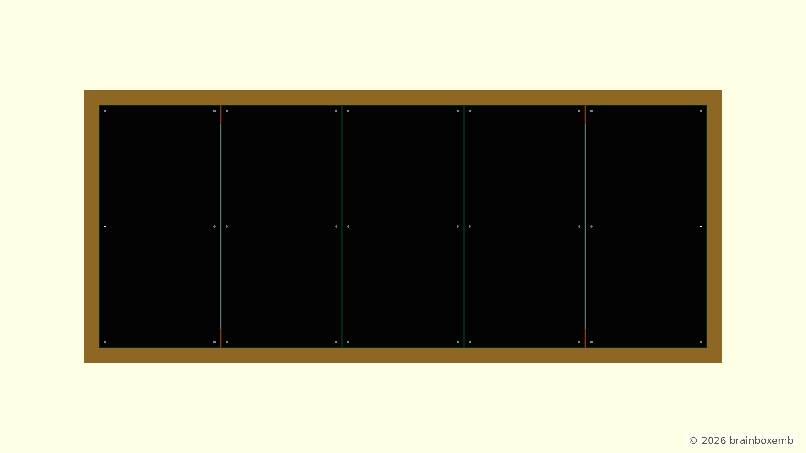

#### Front angled view

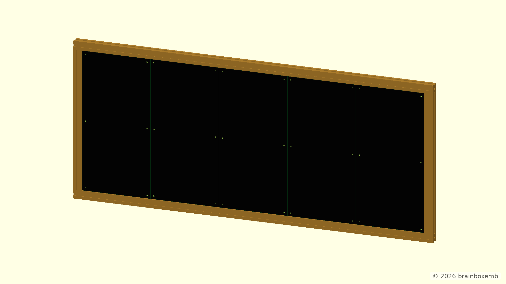

#### Rear view

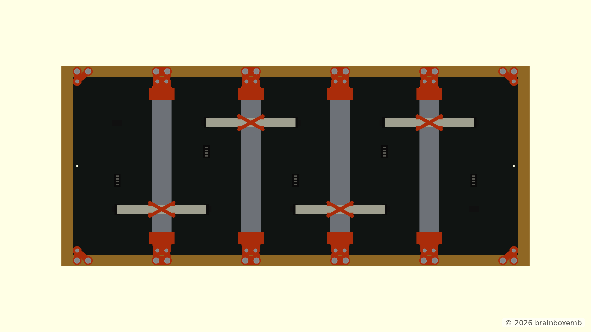

#### Rear angled view

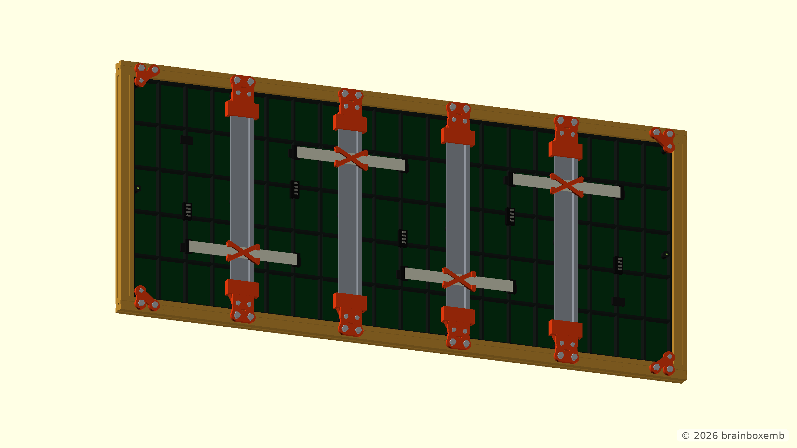

#### Exploded rear view

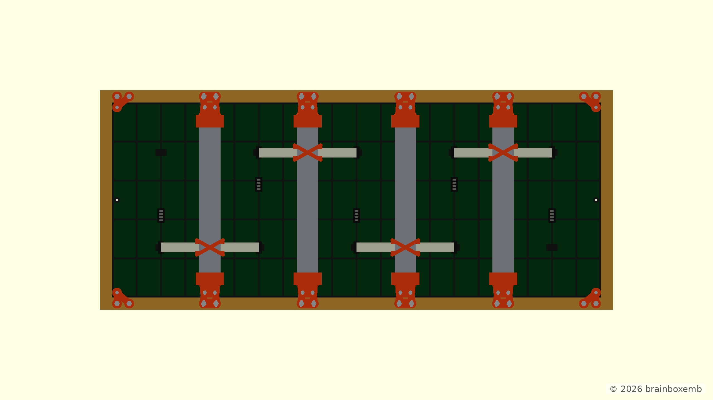

#### Exploded rear angled view

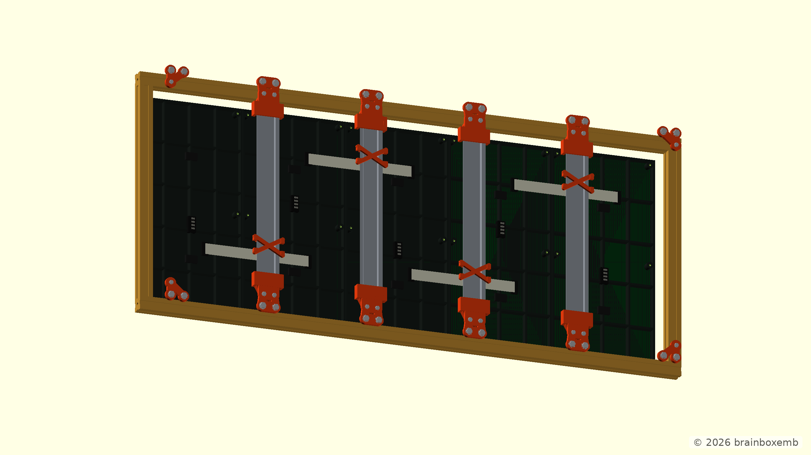

### CAD structure

The V1.0 OpenSCAD model is divided into configuration, individual components and assemblies. Fixed render definitions are included so documentation images can be reproduced locally or by the shared GitHub Actions renderer.

```text
v1.0/cad/
├── main.scad
├── config/
│   └── project_config.scad
├── components/
│   ├── ...
│   └── _lib/
│       └── fasteners.scad
├── assemblies/
│   ├── display_assembly.scad
│   ├── frame_assembly.scad
│   ├── panels_assembly.scad
│   ├── hardware_assembly.scad
│   ├── frame_system_assembly.scad
│   └── ...
└── renders/
    ├── front.scad
    ├── front_angled.scad
    ├── rear.scad
    ├── rear_angled.scad
    ├── exploded_rear.scad
    └── exploded_rear_angled.scad
```

Open `v1.0/cad/main.scad` to view and configure the complete model.

## V1.1

### Inspiration

The modular frame approach explored in V1.1 was partly inspired by a **modular MFT router jig**. Its use of repeatable 3D-printed sections that combine into a larger structure helped shape the idea of building the HUB75 support frame from a regular grid of printed modules.

[](https://www.youtube.com/watch?v=97l0Tzk7k6Y)

*Source: [YouTube — Modular MFT reference](https://www.youtube.com/watch?v=97l0Tzk7k6Y). The image is included as a visual reference to the original video. Copyright remains with the original creator.*

The MFT concept was used as inspiration for the **modular construction principle and overall module shape**. V1.1 adapts that idea to the mechanical requirements and mounting pattern of the HUB75 display panels.

### Concept

V1.1 takes a different approach to the structural frame.

Instead of using 20 × 20 mm aluminium extrusion as the main structure, the frame is built from modular **160 × 160 mm 3D-printed sections**. The module size follows the nominal 160 mm dimension of the HUB75 panels and creates a regular 5 × 2 structural grid behind the five displays.

The current concept includes:

- ten 160 × 160 mm 3D-printed frame modules;
- large central openings to reduce material usage and keep the rear of the panels accessible;
- interlocking edges that position neighbouring frame modules;
- alternating module colours in the OpenSCAD model to make the modular construction easier to inspect;
- mounting features that use the existing HUB75 panel screw locations;
- dedicated seam joiners connecting neighbouring panels and frame sections;
- two continuous Ø10 × 1 mm aluminium tubes, each 800 mm long;
- integrated snap clamps connecting the upper and lower frame modules to these tubes.

The aluminium tubes provide a continuous structural reference across the full width of the display and are intended to improve alignment and stiffness.

Their position also leaves open the possibility of using the tubes as a mounting interface for additional parts on the front side, such as a future display surround or bezel.

V1.1 is retained as the more elaborate modular printed-frame concept. V1.2 intentionally simplifies this approach before further refinement.

The OpenSCAD model is stored in:

```text
v1.1/cad/
```

### Renders

Reference renders generated from the current V1.1 OpenSCAD model are stored in:

```text
v1.1/out/png/
```

#### Front view

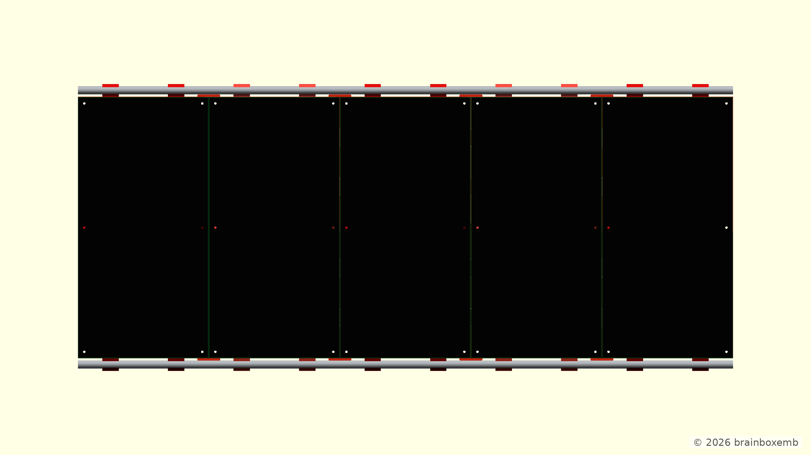

#### Front angled view

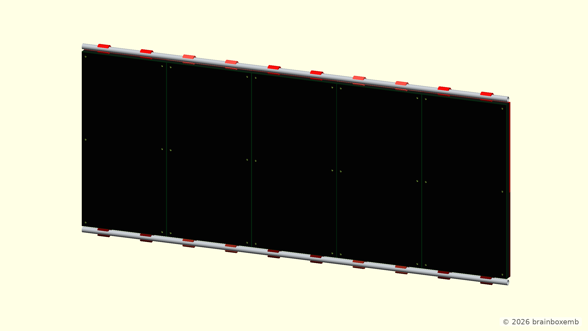

#### Rear view


#### Rear angled view

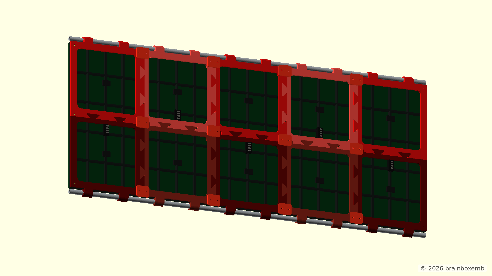

#### Exploded rear view


#### Exploded rear angled view

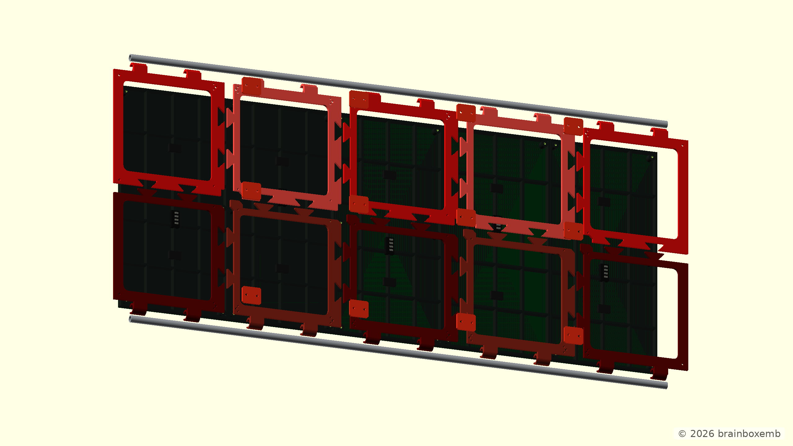

### CAD structure

V1.1 continues to use the modular OpenSCAD structure introduced for the project.

```text
v1.1/cad/
├── main.scad
├── config/
│   └── project_config.scad
├── components/
│   ├── hub75_panel.scad
│   ├── frame_module.scad
│   ├── panel_seam_joiner.scad
│   └── ...
├── assemblies/
│   ├── panels_assembly.scad
│   ├── frame_modules_assembly.scad
│   ├── seam_joiners_assembly.scad
│   ├── display_assembly.scad
│   └── ...
└── renders/
    ├── front.scad
    ├── front_angled.scad
    ├── rear.scad
    ├── rear_angled.scad
    ├── exploded_rear.scad
    └── exploded_rear_angled.scad
```

Open `v1.1/cad/main.scad` to view the complete concept.

## V1.2

V1.2 coupler placement is based on the exact 160 × 320 mm nominal panel grid. Local seam locators use the larger gap at the tapered rear mounting plane, with 0.25 mm print clearance per side; see `v1.2/doc/grid-and-fit.md`.


### Concept

V1.2 is a deliberately simpler continuation of V1.1.

Instead of building a complete 160 × 160 mm printed frame grid first, V1.2 connects the HUB75 panels directly at their existing screw positions. The purpose of this version is to manufacture and test the simplest useful structure and determine how much stiffness the direct panel connections and aluminium tubes already provide.

The current V1.2 concept includes:

- five HUB75 panels in the same nominal 800 × 320 mm arrangement;
- no 160 × 160 mm printed frame modules;
- no puzzle or dovetail interlocks;
- four `middle_panel_coupler` parts at the internal panel seams;
- upper and lower `horizontal_edge_panel_coupler` parts at each internal seam;
- separate mirrored `corner_edge_panel_coupler` variants at the four outside corners;
- two continuous Ø10 × 1 mm aluminium tubes;
- dedicated fit-section views for checking the coupler-to-panel interfaces.

The printed couplers follow the actual rear-panel rib geometry and use the existing screw locations, locator features and reinforcement-bushing geometry as alignment references. The edge and corner families are dimensioned from the nominal 160 × 320 mm panel boundary while their physical fit geometry remains tied to the real panel rails, holes and bosses. This keeps the parts visually and mechanically consistent without moving the real fit features.

The nominal placement grid is authoritative: the original panel is **320 × 160 mm**, and in this portrait assembly each cell is therefore **160 mm in X × 320 mm in Z**. The measured physical panel is 159.70 × 319.71 mm and is centred inside that cell. Internal coupler centres sit exactly on the nominal grid boundaries, while the physical undersize appears only as a small panel-to-panel gap. Panel-fit guides use a fixed **0.25 mm clearance per mating side**, independent of the small/medium/large coupler profile. The seam locator does not use the 0.30 mm front/body gap: it engages at the tapered rear mounting plane, where the usable seam is wider. With the STEP-derived rear inset and 0.25 mm print clearance per mating side, the current locator is about 2.30 mm wide and remains centred exactly on the nominal grid seam.

### Panel dimensional basis

For V1.2, the panel's mechanical dimensions and mounting pattern are modelled in `components/hub75_panel.scad`. This component is deliberately project-independent and is the authoritative source for the physical panel geometry.

Current principal dimensions are:

```text
Panel width       159.70 mm
Panel height      319.71 mm
Panel depth        14.50 mm
```

The panel component also owns the rear rib geometry, mounting-hole pattern, IDC connector geometry, locator pins and reinforcement-bushing dimensions. The reinforcement feature is modelled as a Ø14 mm internal boss that is flush with the rear mounting plane, with a Ø10 mm × 2.5 mm recess and a central Ø2.5 mm blind hole extending 10 mm from the bottom of that recess.

### Aluminium tube layout

V1.2 now defines the aluminium-tube placement as an explicit **project-level relationship**, rather than deriving it indirectly from the clip geometry.

The current reference envelope is:

```text
Overall project envelope       840 × 360 mm
Tube centre-to-centre spacing  340 mm
Tube outer diameter             10 mm
Tube centre from panel rear      7 mm
```

The 840 × 360 mm project envelope is centred around **X = 0 / Z = 0**. The project assembly uses the **rear mounting plane of the HUB75 panels as Y = 0**. The two tube centres are positioned symmetrically at Z = ±170 mm, giving a 340 mm centre-to-centre distance. Their Y centre is **-7 mm**, i.e. 7 mm from the rear mounting plane toward the panel front.

`main.scad` also provides an optional `show_project_envelope` checkbox. When enabled, a wireframe 840 × 360 mm reference box is drawn around the assembly. Its Y-direction corner lines extend from the panel front face to the Y=0 rear mounting plane, making the panel depth and the project Y reference easy to inspect.

The Y position is defined from the **rear mounting plane of the HUB75 panel toward the front face**. With the rear plane at Y=0, the 14.5 mm panel front is at Y=-14.5 mm and the Ø10 mm tube centre is at Y=-7 mm. This leaves:

- 2.0 mm between the rear panel plane and the nearest tube surface;
- 2.5 mm between the opposite tube surface and the panel front face.

This relationship is stored in `config/project_config.scad` as:

```scad
display_envelope_width = 840.0;
display_envelope_height = 360.0;
tube_center_spacing = 340.0;
tube_center_from_panel_rear = 7.0;
```

The physical tube dimensions remain in `components/aluminium_tube.scad`.

### Configuration architecture

V1.2 deliberately separates **reusable physical components** from **project-derived printable parts**.

`components/` contains parts whose physical definition is independent of this specific five-panel assembly. Examples include:

- `hub75_panel.scad` — authoritative HUB75 panel geometry;
- `aluminium_tube.scad` — physical tube diameter and wall thickness;
- `tube_clip.scad` — reusable snap-clip geometry;
- `_lib/reference_grid.scad` — generic inspection helper.

`project_components/` contains printable parts whose geometry is deliberately derived from both reusable component dimensions and `project_config.scad`. The V1.2 couplers belong here because their clip positions, display-edge relationships and assembly clearances are specific to this project configuration. Shared coupler rules such as rail-following fit and profile dimensions are kept in `project_components/_lib/` so edge and corner variants do not duplicate those calculations. The material wall and guide height are selected through the project-wide coupler design profile.

This means it is expected and intentional that a file in `project_components/` can depend on project settings. A generic component under `components/` should not.

### Panel chain order

Panel order is defined **from the rear of the display**. By default, **panel 1 is the rear-left panel and its HUB75 input is at the top**. Every following panel is rotated 180 degrees so the data path snakes across the rear of the display.

The start side and the first input position are explicit project parameters:

```text
rear_chain_start_side = "left"
first_panel_input_side = "top"
```

### Bracket inspiration

The following Printables projects are useful references for refining the printed panel couplers and brackets.

#### Brackets for joining HUB75 LED panels

[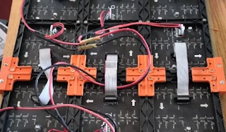](https://www.printables.com/model/1294572-brackets-for-joining-hub75-led-panels)

*Source: [Printables — Brackets for joining HUB75 LED panels](https://www.printables.com/model/1294572-brackets-for-joining-hub75-led-panels).*

#### HUB75 5mm Pitch 4 Panel Bracket

[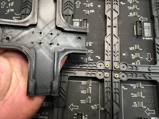](https://www.printables.com/model/578204-hub75-5mm-pitch-4-panel-bracket)

*Source: [Printables — HUB75 5mm Pitch 4 Panel Bracket](https://www.printables.com/model/578204-hub75-5mm-pitch-4-panel-bracket).*

### Renders

Reference renders generated from the current V1.2 OpenSCAD model are stored in:

```text
v1.2/out/png/
```

#### Panel reference

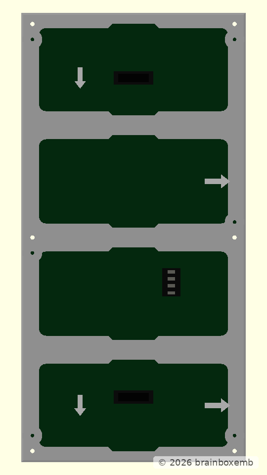

#### Panel reference — angled

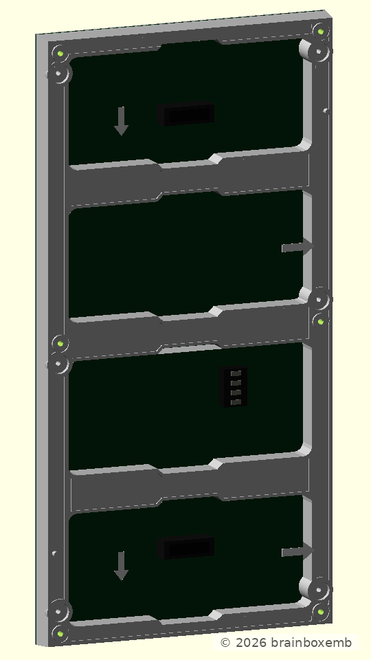

#### Front view

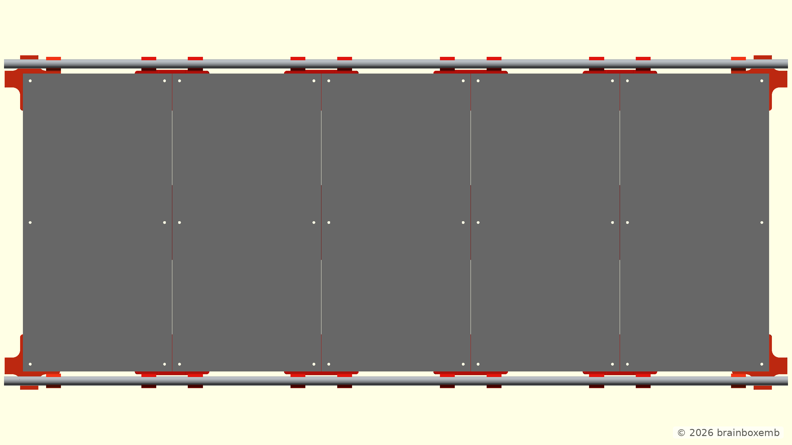

#### Front angled view

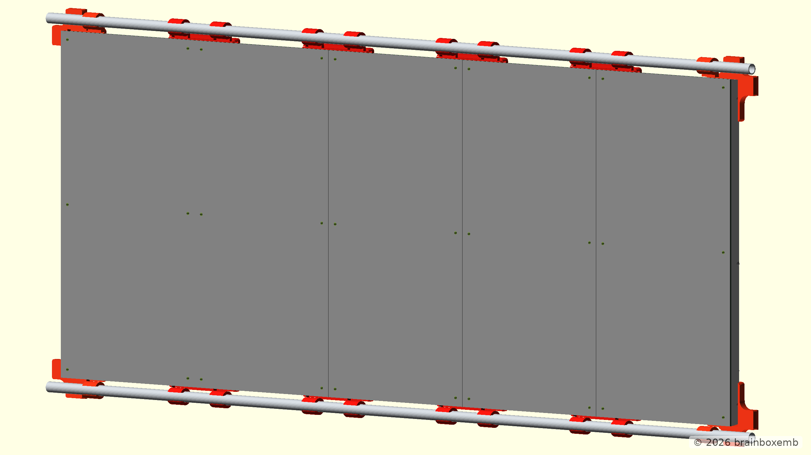

#### Rear view

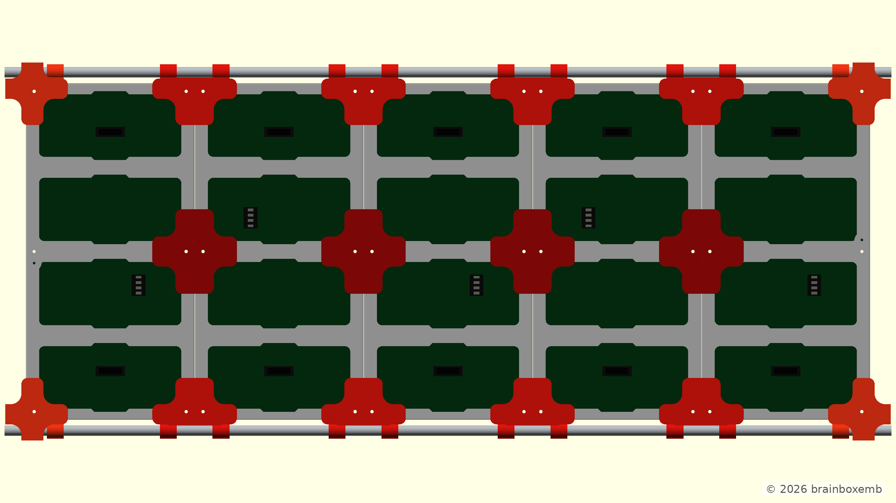

#### Rear angled view

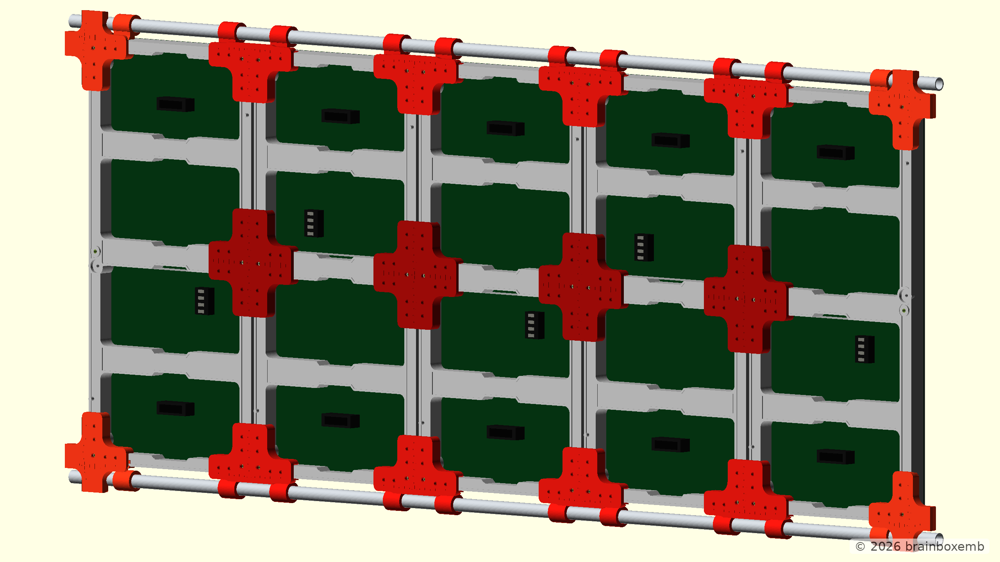

#### Rear wiring / panel order

This view shows the HUB75 panel chain as seen from the rear. Panel 1 is the first module in the chain, with its input positioned at the top. The alternating panel orientation makes the intended IN/OUT routing across the five panels easier to verify.

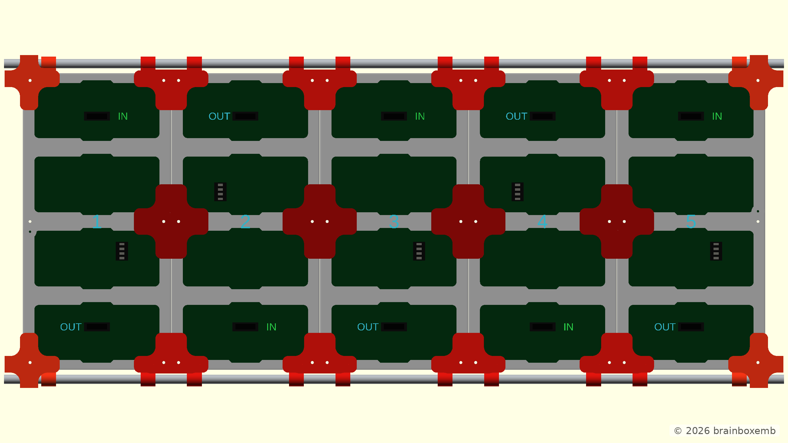

#### Rear fit section

This diagnostic render shows a section through the complete rear assembly, 5 mm into the panel structure. It is intended to make the fit between the printed couplers and the HUB75 rear ribs visible across all panel seams at once.

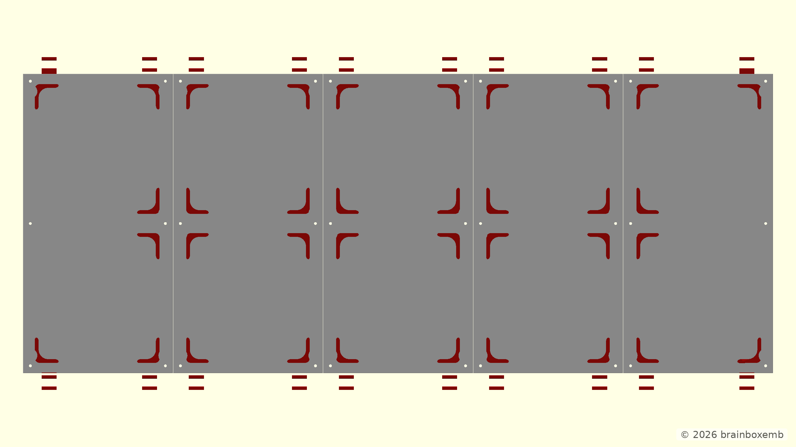

#### Coupler comparison — side by side

All four printable coupler variants are shown next to each other using their
geometric `+` reference points rather than their screw holes as the alignment
reference. The reference points are placed on grid intersections, making it
easier to compare the nominal panel-edge references, overall height and profile
proportions across the coupler family.

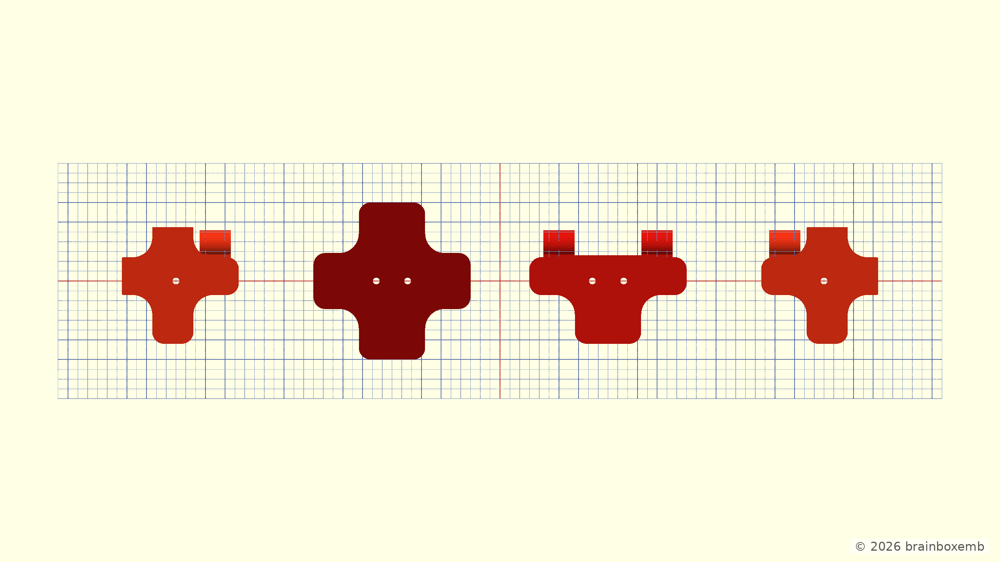

#### Coupler comparison — stacked

The two coupler comparison renders use the standard reference grid by default (10 mm major spacing with 5 mm half-steps), while the same grid remains controlled by `show_reference_grid` in `main.scad`.

The same four variants are stacked vertically for a second proportional check.
The view is intended primarily for comparing overall width and the relationship
between the shared profile rules of the middle, edge and corner variants.

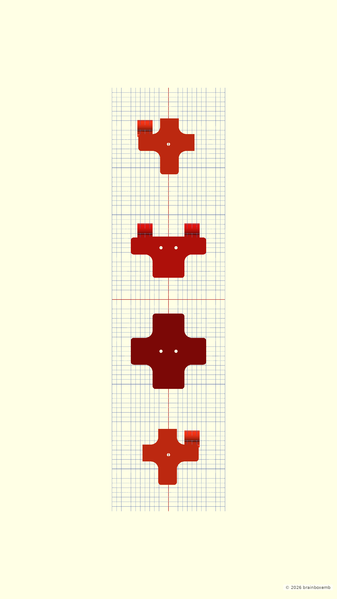

#### Middle panel coupler fit section

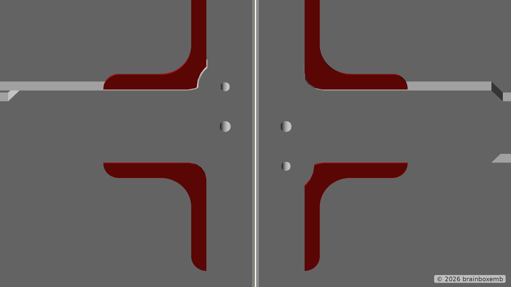

#### Transverse coupler fit sections

Two additional diagnostic renders cut **across** the nominal panel seam. They expose the Y/Z profile of the seam locator, rear guide and panel body, making the rib height, lead-in and alignment visible even where the normal rear view is obscured by the edge ridge. Both use the canonical `medium` profile.

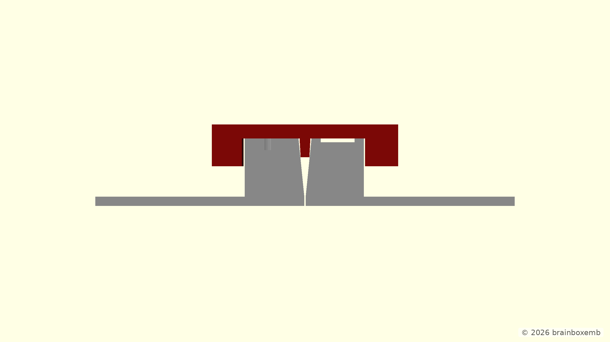

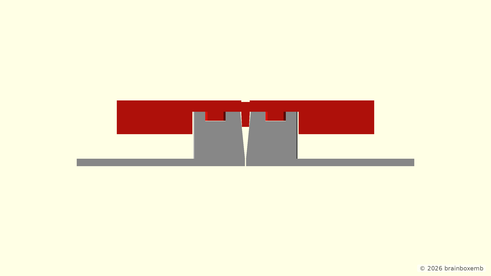

#### Exploded rear view

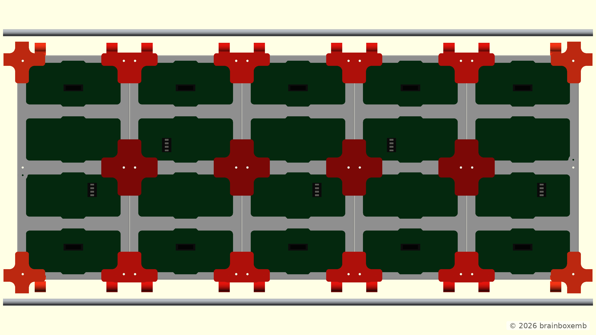

#### Exploded rear angled view

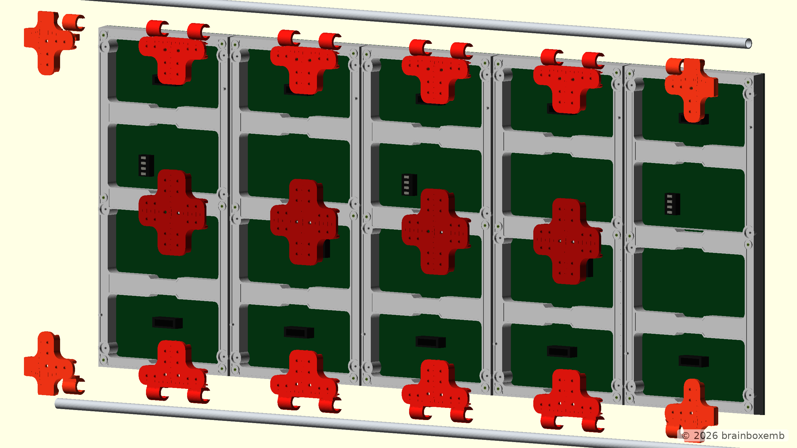

### Coupler design profiles

V1.2 provides three fixed project-wide coupler presets plus a custom mode. The profile can be selected from the OpenSCAD Customizer when `v1.2/cad/main.scad` is open.

```text
small        60 ×  60 mm profile envelope, 2 mm wall,  4 mm guide height, 2 mm base plate
medium       80 ×  80 mm profile envelope, 4 mm wall,  6 mm guide height, 3 mm base plate
large       100 × 100 mm profile envelope, 6 mm wall, 10 mm guide height, 4 mm base plate
custom       user-entered profile size, wall thickness, guide height and base-plate thickness
```

The three named presets are fixed and reproducible. **Medium is the canonical V1.2 profile** and is used by the normal full-display documentation renders and the complete display STL. The numeric fields under **Custom coupler dimensions** are ignored while `large`, `medium` or `small` is selected. Selecting `custom` activates those four values directly; no separate enable checkbox and no magic `0` override values are used. The custom fields start with the medium dimensions as a practical baseline.

The decorative Ø3 mm blind-pocket raster adapts automatically to the effective profile size, including custom sizes. Individual printable couplers are rendered and exported as STL for all three named profiles. Reusable objects such as the HUB75 panel and aluminium tube remain independent of these project-specific choices.

#### Profile render galleries

Each profile has a single Markdown gallery so all of its coupler renders can be reviewed without opening the PNG files one by one:

- [Small coupler profile](v1.2/doc/small.md)
- [Medium coupler profile](v1.2/doc/medium.md) — canonical V1.2 profile
- [Large coupler profile](v1.2/doc/large.md)


### CAD structure

```text
v1.2/cad/
├── main.scad
├── config/
│   └── project_config.scad
├── components/
│   ├── hub75_panel.scad
│   ├── aluminium_tube.scad
│   ├── tube_clip.scad
│   └── _lib/
│       ├── reference_grid.scad
│       └── reference_box.scad
├── project_components/
│   ├── middle_panel_coupler.scad
│   ├── horizontal_edge_panel_coupler.scad
│   ├── corner_edge_panel_coupler.scad
│   └── _lib/
│       ├── coupler_profile.scad
│       └── coupler_dimensions.scad
├── assemblies/
│   ├── panels_assembly.scad
│   ├── couplers_assembly.scad
│   ├── tubes_assembly.scad
│   ├── middle_panel_coupler_fit_section.scad
│   ├── coupler_fit_cross_sections.scad
│   ├── rear_fit_section.scad
│   ├── coupler_comparison_assembly.scad
│   └── display_assembly.scad
├── exports/
│   ├── display.scad                         # canonical MEDIUM complete display
│   ├── middle_panel_coupler_{small,medium,large}.scad
│   ├── horizontal_edge_panel_coupler_{small,medium,large}.scad
│   ├── corner_edge_panel_coupler_left_{small,medium,large}.scad
│   └── corner_edge_panel_coupler_right_{small,medium,large}.scad
└── renders/
    ├── front.scad
    ├── front_angled.scad
    ├── panel.scad
    ├── panel_angled.scad
    ├── rear.scad
    ├── rear_angled.scad
    ├── rear_wiring.scad
    ├── middle_panel_fit_section.scad
    ├── middle_panel_fit_cross_section.scad
    ├── horizontal_edge_fit_cross_section.scad
    ├── rear_fit_section.scad
    ├── couplers_side_by_side.scad          # canonical MEDIUM comparison
    ├── couplers_stacked.scad                # canonical MEDIUM comparison
    ├── couplers_{small,medium,large}_side_by_side.scad
    ├── couplers_{small,medium,large}_stacked.scad
    ├── couplers_{small,medium,large}_middle.scad
    ├── couplers_{small,medium,large}_horizontal_edge.scad
    ├── couplers_{small,medium,large}_corner_left.scad
    ├── couplers_{small,medium,large}_corner_right.scad
    ├── exploded_rear.scad
    └── exploded_rear_angled.scad
```

Open `v1.2/cad/main.scad` to view the complete concept.

`assemblies/coupler_comparison_assembly.scad` is also directly openable in OpenSCAD. It provides `side_by_side` and `stacked` comparison modes and can use the same reference-grid settings as the normal inspection views.

## Automatic renders and exports

The official PNG views and printable STL exports are generated through the shared reusable workflow in the `brainboxemb/brainboxemb.github.actions` repository.

The HUB75 repository keeps the small caller workflow:

```text
.github/workflows/render-openscad.yml
```

Each CAD version keeps its fixed camera definitions in `renders/*.scad`. For V1.2 the normal display renders are fixed to the canonical `medium` profile. Additional coupler-only render entry points generate `small`, `medium` and `large` comparison/detail images. V1.2 also keeps printable entry points in `exports/*.scad`: the complete assembled display is exported once in `medium`, while each individual coupler variant is exported separately for `small`, `medium` and `large`.

Generated render output is stored under:

```text
v1.0/out/png/
v1.1/out/png/
v1.2/out/png/
```

## Repository structure

```text
.
├── README.md
├── _images/
│   ├── instructables_simple-extruded-aluminum-frame_w320.webp
│   ├── youtube_97l0Tzk7k6Y_modular-mft_w320.jpg
│   ├── printables_brackets-for-joining-hub75-led-panels_w320.webp
│   └── printables_hub75-5mm-pitch-4-panel-bracket_w320.webp
├── doc/
│   ├── v1.0/
│   ├── v1.1/
│   └── v1.2/
│       ├── README.md
│       ├── small.md
│       ├── medium.md
│       └── large.md
├── .github/
│   └── workflows/
│       └── render-openscad.yml
├── cad/
│   ├── v1.0/
│   ├── v1.1/
│   └── v1.2/
└── out/
    ├── v1.0/
    ├── v1.1/
    └── v1.2/
```
