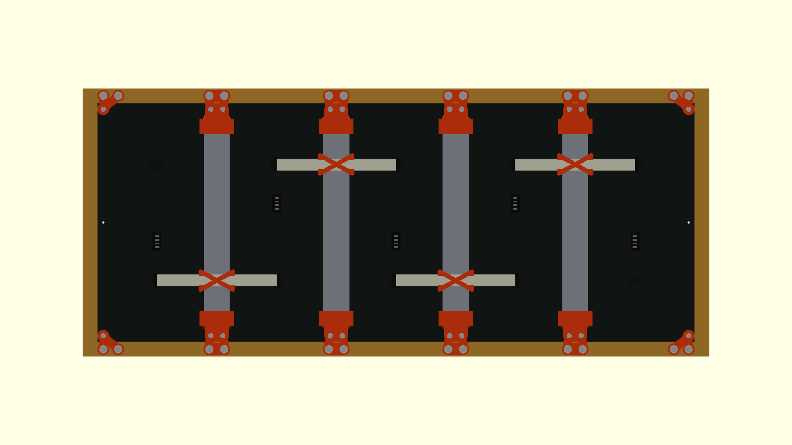
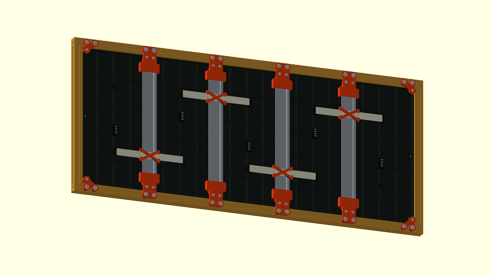
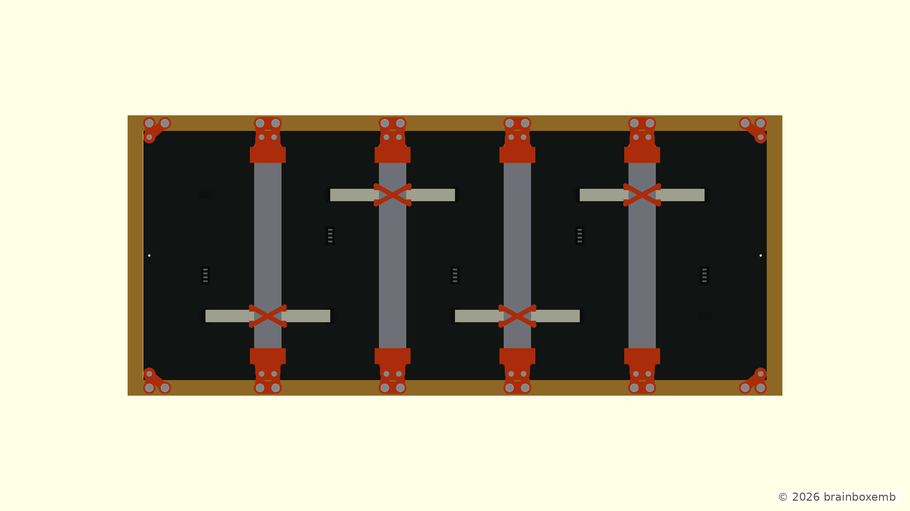
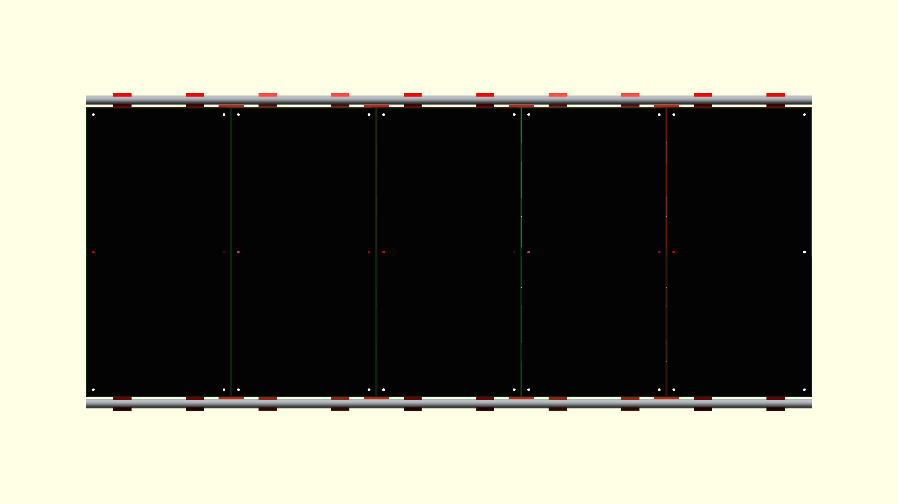
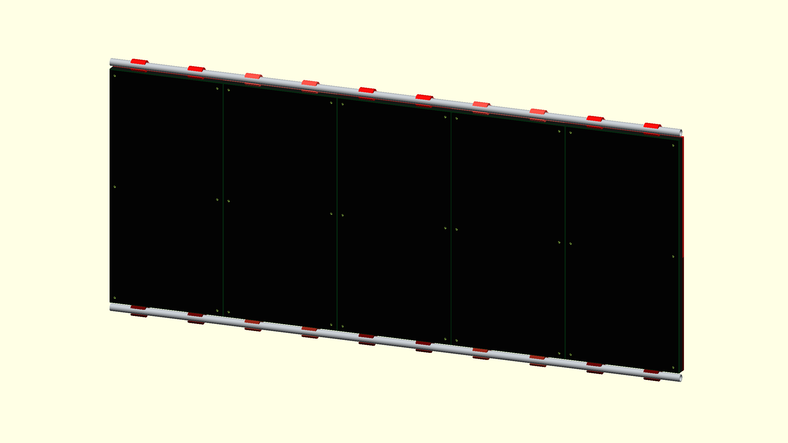
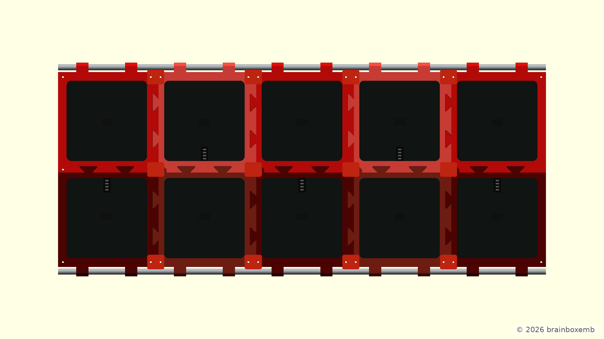
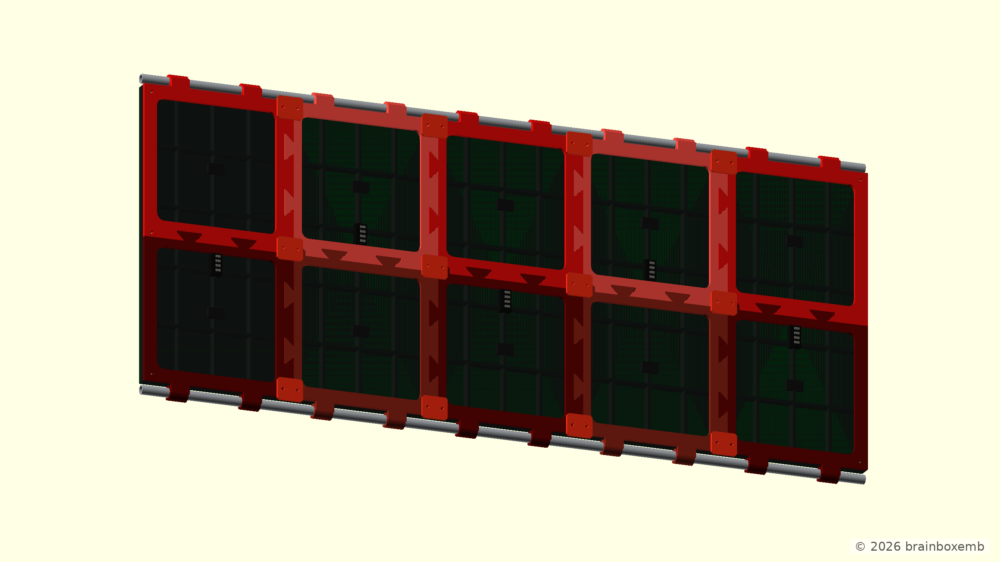
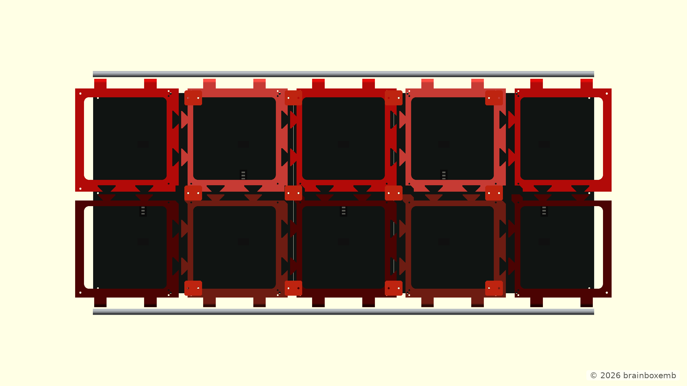
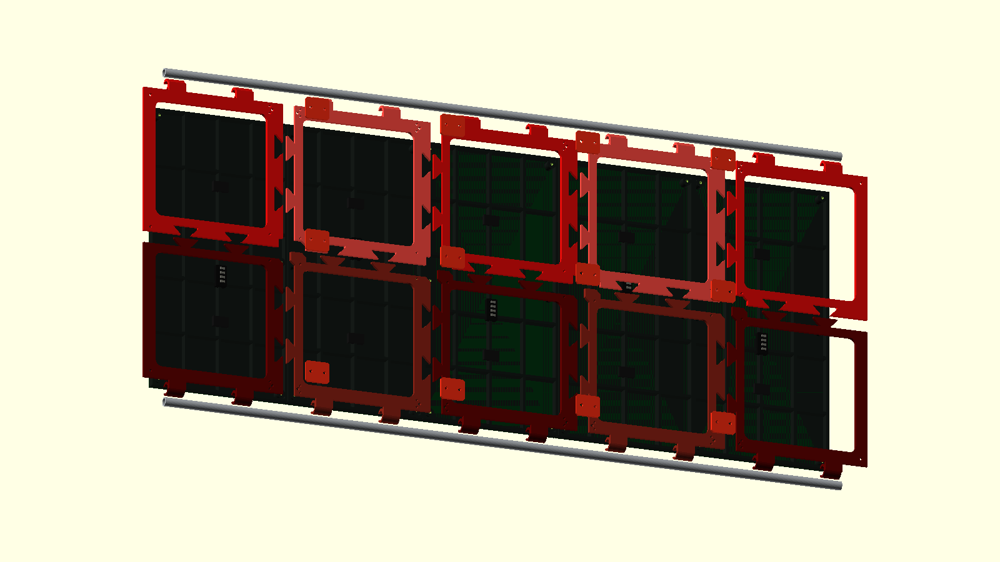

# HUB75 Display Frame

> The model and documentation were developed with the assistance of ChatGPT.

This repository contains the OpenSCAD development of a frame for five HUB75 LED matrix panels.

The design uses a modular OpenSCAD structure with separate components and assemblies. Individual parts can be opened, rendered and tuned independently, while the complete construction can be viewed from `main.scad`.

> **Project status:** Concept development  
> V1.0 explored a frame based on 20 × 20 mm aluminium extrusion and is mainly retained as a reference concept. Active development has moved to V1.1, which replaces the extrusion frame with modular 3D-printed frame sections, combined with two continuous aluminium tubes for alignment and stiffness.

## V1.0

### Inspiration

The aluminium-frame approach in V1.0 was inspired by the Instructables project [**Simple Extruded Aluminum Frame for LED Panels**](https://www.instructables.com/Simple-Extruded-Aluminum-Frame-for-LED-Panels/), created by **NotLikeALeafOnTheWind**.

[](https://www.instructables.com/Simple-Extruded-Aluminum-Frame-for-LED-Panels/)

*Source: [Instructables / NotLikeALeafOnTheWind — Simple Extruded Aluminum Frame for LED Panels](https://www.instructables.com/Simple-Extruded-Aluminum-Frame-for-LED-Panels/). The image is included as a visual reference to the original project. Copyright remains with the original creator.*

### Concept

V1.0 explores an aluminium-extrusion-based structure for supporting the HUB75 panels and the components mounted directly to that structure.

The concept includes:

- a 20 × 20 mm aluminium extrusion frame;
- five HUB75 LED matrix panels;
- panel mounting brackets;
- TS35 DIN rails positioned around the panel seams;
- cable clips and ribbon-cable routing;
- frame-mounted fasteners;
- optional ESP32 mounting;
- optional power-supply mounting.

V1.0 is a concept drawing and is primarily retained as a reference for this construction approach.

The OpenSCAD model is stored in:

```text
cad/v1.0/
```

### Renders

Reference renders generated from the V1.0 OpenSCAD model are stored in:

```text
out/v1.0/png/
```

The straight views provide a technical reference, while the angled and exploded views make the frame depth and the relationship between the aluminium frame, panels and rear mounting hardware easier to inspect.

#### Front view


#### Front angled view


#### Rear view



#### Rear angled view



#### Exploded rear view



#### Exploded rear angled view


### CAD structure

The V1.0 OpenSCAD model is divided into configuration, individual components and assemblies. Fixed render definitions and a render script are included so documentation images can be reproduced locally or by GitHub Actions.

```text
cad/v1.0/
├── main.scad
├── config/
│   └── project_config.scad
├── components/
│   ├── ...
│   └── _lib/
│       └── fasteners.scad
├── assemblies/
│   ├── display_assembly.scad
│   ├── frame_assembly.scad
│   ├── panels_assembly.scad
│   ├── hardware_assembly.scad
│   ├── frame_system_assembly.scad
│   └── ...
├── renders/
│   ├── front.scad
│   ├── front_angled.scad
│   ├── rear.scad
│   ├── rear_angled.scad
│   ├── exploded_rear.scad
│   └── exploded_rear_angled.scad
└── scripts/
    └── render_pngs.sh
```

Open `cad/v1.0/main.scad` to view and configure the complete model.

Files in `components/` can be opened directly in OpenSCAD to render and tune individual parts without loading the complete assembly.

Files in `assemblies/` combine these components into functional parts of the complete construction and can also be viewed independently.

## V1.1

### Concept

V1.1 takes a different approach to the structural frame.

Instead of using 20 × 20 mm aluminium extrusion as the main structure, the frame is built from modular **160 × 160 mm 3D-printed sections**. The module size follows the nominal 160 mm dimension of the HUB75 panels and creates a regular 5 × 2 structural grid behind the five displays.

The current concept includes:

- ten 160 × 160 mm 3D-printed frame modules;
- large central openings to reduce material usage and keep the rear of the panels accessible;
- interlocking edges that position neighbouring frame modules;
- alternating module colours in the OpenSCAD model to make the modular construction easier to inspect;
- mounting features that use the existing HUB75 panel screw locations;
- dedicated seam joiners connecting neighbouring panels and frame sections;
- two continuous Ø10 × 1 mm aluminium tubes, each 800 mm long;
- integrated snap clamps connecting the upper and lower frame modules to these tubes.

The aluminium tubes provide a continuous structural reference across the full width of the display and are intended to improve alignment and stiffness.

Their position also leaves open the possibility of using the tubes as a mounting interface for additional parts on the front side, such as a future display surround or bezel.

V1.1 is still an early concept. The geometry of the interlocks, joiners, tube clamps and outer frame will be refined in further iterations.

The OpenSCAD model is stored in:

```text
cad/v1.1/
```

### Renders

Reference renders generated from the current V1.1 OpenSCAD model are stored in:

```text
out/v1.1/png/
```

The straight views are useful as technical references, while the angled views make the depth, module connections and tube clamps easier to inspect.

#### Front view



#### Front angled view



#### Rear view



#### Rear angled view



#### Exploded rear view



#### Exploded rear angled view



### CAD structure

V1.1 continues to use the modular OpenSCAD structure introduced for the project.

```text
cad/v1.1/
├── main.scad
├── config/
│   └── project_config.scad
├── components/
│   ├── hub75_panel.scad
│   ├── frame_module.scad
│   ├── panel_seam_joiner.scad
│   └── ...
├── assemblies/
│   ├── panels_assembly.scad
│   ├── frame_modules_assembly.scad
│   ├── seam_joiners_assembly.scad
│   ├── display_assembly.scad
│   └── ...
├── renders/
│   ├── front.scad
│   ├── front_angled.scad
│   ├── rear.scad
│   ├── rear_angled.scad
│   ├── exploded_rear.scad
│   └── exploded_rear_angled.scad
└── scripts/
    └── render_pngs.sh
```

Open `cad/v1.1/main.scad` to view the complete concept.

The model also provides separate views for individual components and subassemblies, together with exploded views to inspect how the panels, printed frame modules, joiners and aluminium tubes fit together.

## Automatic renders

The official PNG views for both CAD versions can be generated by GitHub Actions. Each CAD version keeps its camera definitions in `renders/*.scad` and its rendering commands in `scripts/render_pngs.sh`.

The workflow renders both versions and updates:

```text
out/v1.0/png/
out/v1.1/png/
```

The Git commit identity used by the workflow is configured through the repository Actions variables `GIT_USER_NAME` and `GIT_USER_EMAIL`.

## Repository structure

```text
.
├── README.md
├── _images/
│   └── instructables_simple-extrued-aluminum-frame_w320.webp
├── .github/
│   └── workflows/
│       └── render-openscad.yml
├── cad/
│   ├── v1.0/
│   │   └── ...
│   └── v1.1/
│       └── ...
└── out/
    ├── v1.0/
    │   └── png/
    │       ├── hub75-display-frame-front.png
    │       ├── hub75-display-frame-front-angled.png
    │       ├── hub75-display-frame-rear.png
    │       ├── hub75-display-frame-rear-angled.png
    │       ├── hub75-display-frame-exploded-rear.png
    │       └── hub75-display-frame-exploded-rear-angled.png
    └── v1.1/
        └── png/
            ├── hub75-display-frame-front.png
            ├── hub75-display-frame-front-angled.png
            ├── hub75-display-frame-rear.png
            ├── hub75-display-frame-rear-angled.png
            ├── hub75-display-frame-exploded-rear.png
            └── hub75-display-frame-exploded-rear-angled.png
```
