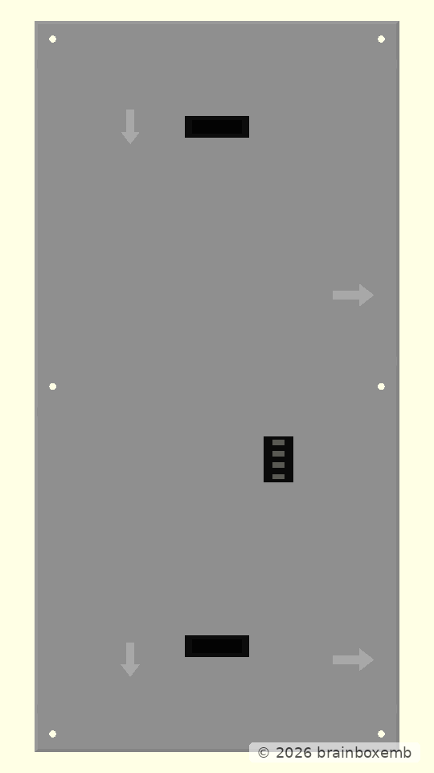
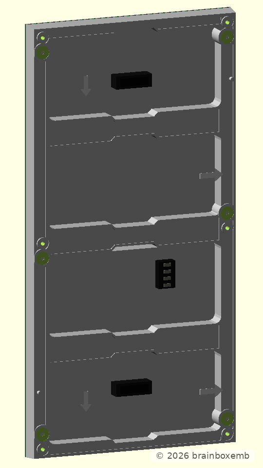
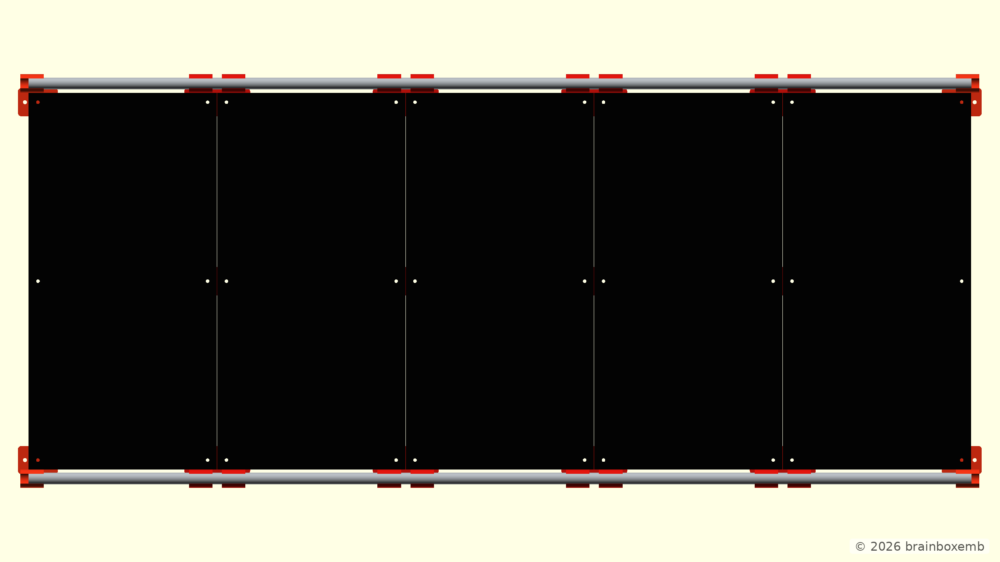
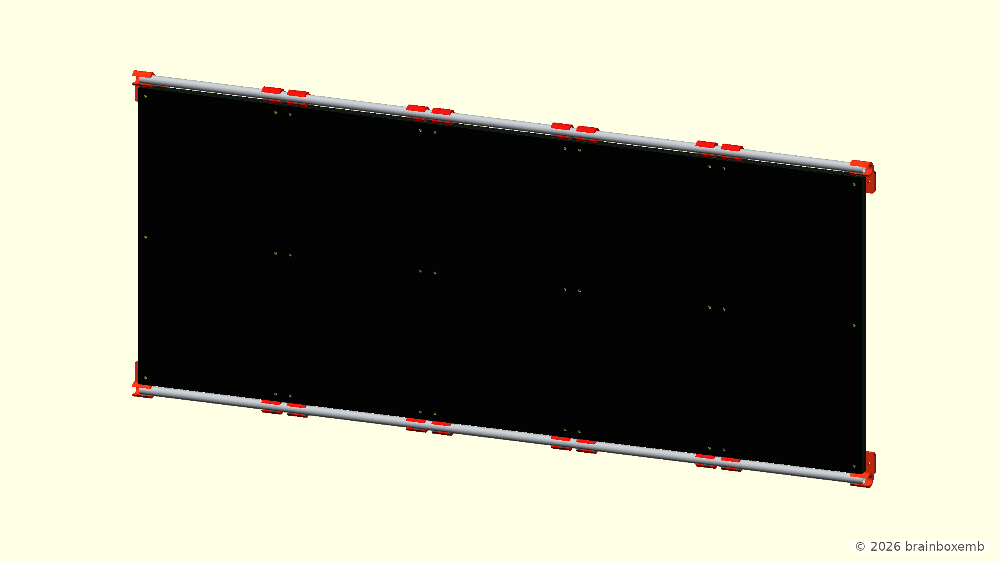
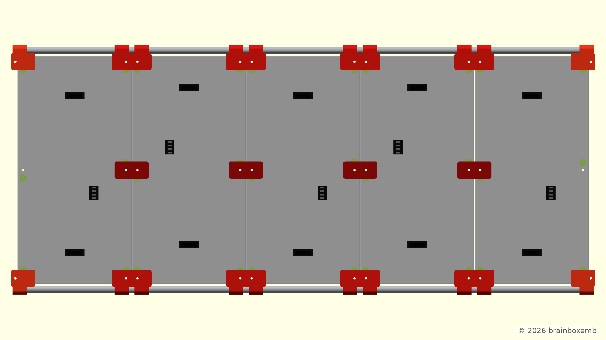
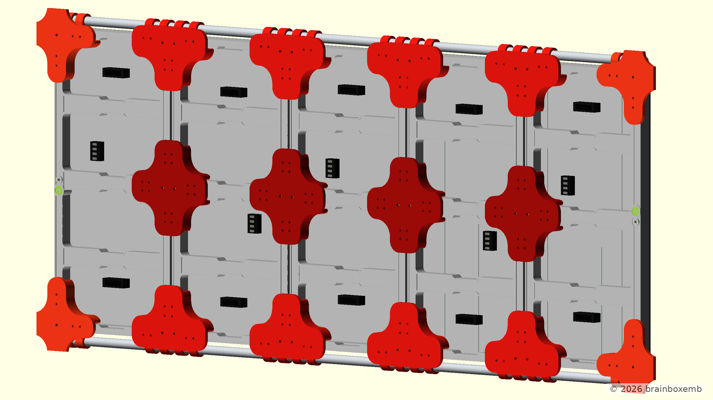
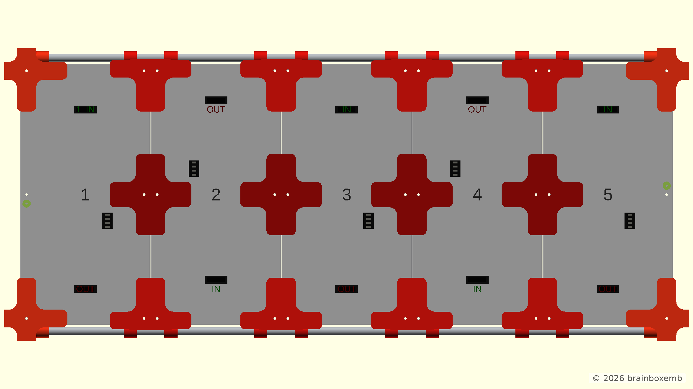
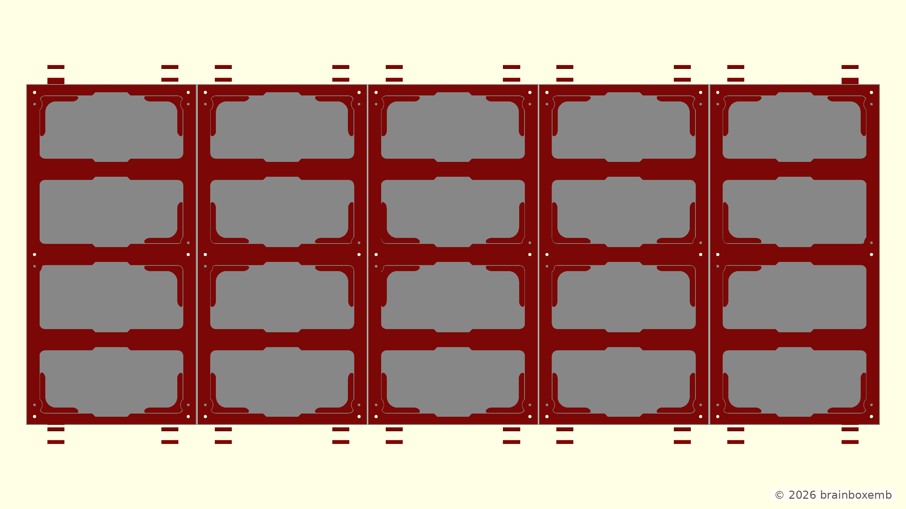
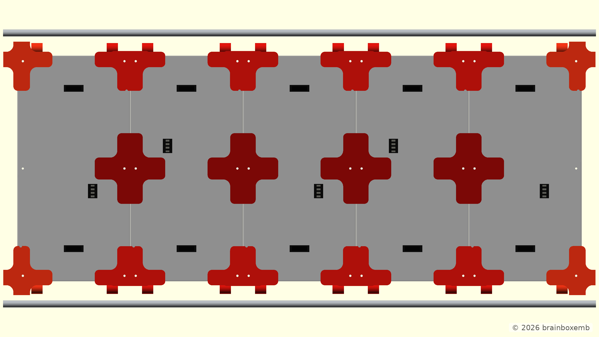
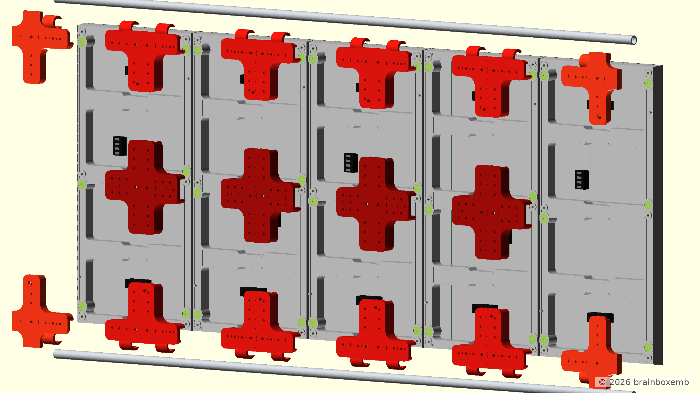

# HUB75 Display Frame

> The model and documentation were developed with the assistance of ChatGPT.

This repository contains the OpenSCAD development of a frame for five HUB75 LED matrix panels.

The design uses a modular OpenSCAD structure with separate components and assemblies. Individual parts can be opened, rendered and tuned independently, while the complete construction can be viewed from `main.scad`.

> **Project status:** Concept development  
> V1.0 explored a frame based on 20 × 20 mm aluminium extrusion and is mainly retained as a reference concept. V1.1 explored a modular 3D-printed frame combined with two continuous aluminium tubes. Active development has moved to V1.2, which deliberately reduces the printed structure to simple direct panel-to-panel couplers so the mechanical strength can be tested before adding more complexity.

## V1.0

### Inspiration

The aluminium-frame approach in V1.0 was inspired by the Instructables project [**Simple Extruded Aluminum Frame for LED Panels**](https://www.instructables.com/Simple-Extruded-Aluminum-Frame-for-LED-Panels/), created by **NotLikeALeafOnTheWind**.

[](https://www.instructables.com/Simple-Extruded-Aluminum-Frame-for-LED-Panels/)

*Source: [Instructables / NotLikeALeafOnTheWind — Simple Extruded Aluminum Frame for LED Panels](https://www.instructables.com/Simple-Extruded-Aluminum-Frame-for-LED-Panels/). The image is included as a visual reference to the original project. Copyright remains with the original creator.*

### Concept

V1.0 explores an aluminium-extrusion-based structure for supporting the HUB75 panels and the components mounted directly to that structure.

The concept includes:

- a 20 × 20 mm aluminium extrusion frame;
- five HUB75 LED matrix panels;
- panel mounting brackets;
- TS35 DIN rails positioned around the panel seams;
- cable clips and ribbon-cable routing;
- frame-mounted fasteners;
- optional ESP32 mounting;
- optional power-supply mounting.

V1.0 is a concept drawing and is primarily retained as a reference for this construction approach.

The OpenSCAD model is stored in:

```text
cad/v1.0/
```

### Renders

Reference renders generated from the V1.0 OpenSCAD model are stored in:

```text
out/v1.0/png/
```

The straight views provide a technical reference, while the angled and exploded views make the frame depth and the relationship between the aluminium frame, panels and rear mounting hardware easier to inspect.

#### Front view


#### Front angled view


#### Rear view


#### Rear angled view


#### Exploded rear view


#### Exploded rear angled view


### CAD structure

The V1.0 OpenSCAD model is divided into configuration, individual components and assemblies. Fixed render definitions are included so documentation images can be reproduced locally or by the shared GitHub Actions renderer.

```text
cad/v1.0/
├── main.scad
├── config/
│   └── project_config.scad
├── components/
│   ├── ...
│   └── _lib/
│       └── fasteners.scad
├── assemblies/
│   ├── display_assembly.scad
│   ├── frame_assembly.scad
│   ├── panels_assembly.scad
│   ├── hardware_assembly.scad
│   ├── frame_system_assembly.scad
│   └── ...
└── renders/
    ├── front.scad
    ├── front_angled.scad
    ├── rear.scad
    ├── rear_angled.scad
    ├── exploded_rear.scad
    └── exploded_rear_angled.scad
```

Open `cad/v1.0/main.scad` to view and configure the complete model.

Files in `components/` can be opened directly in OpenSCAD to render and tune individual parts without loading the complete assembly.

Files in `assemblies/` combine these components into functional parts of the complete construction and can also be viewed independently.

## V1.1

### Inspiration

The modular frame approach explored in V1.1 was partly inspired by a **modular MFT router jig**. Its use of repeatable 3D-printed sections that combine into a larger structure helped shape the idea of building the HUB75 support frame from a regular grid of printed modules.

[](https://www.youtube.com/watch?v=97l0Tzk7k6Y)

*Source: [YouTube — Modular MFT reference](https://www.youtube.com/watch?v=97l0Tzk7k6Y). The image is included as a visual reference to the original video. Copyright remains with the original creator.*

The MFT concept was used as inspiration for the **modular construction principle and overall module shape**. V1.1 adapts that idea to the mechanical requirements and mounting pattern of the HUB75 display panels.

### Concept

V1.1 takes a different approach to the structural frame.

Instead of using 20 × 20 mm aluminium extrusion as the main structure, the frame is built from modular **160 × 160 mm 3D-printed sections**. The module size follows the nominal 160 mm dimension of the HUB75 panels and creates a regular 5 × 2 structural grid behind the five displays.

The current concept includes:

- ten 160 × 160 mm 3D-printed frame modules;
- large central openings to reduce material usage and keep the rear of the panels accessible;
- interlocking edges that position neighbouring frame modules;
- alternating module colours in the OpenSCAD model to make the modular construction easier to inspect;
- mounting features that use the existing HUB75 panel screw locations;
- dedicated seam joiners connecting neighbouring panels and frame sections;
- two continuous Ø10 × 1 mm aluminium tubes, each 800 mm long;
- integrated snap clamps connecting the upper and lower frame modules to these tubes.

The aluminium tubes provide a continuous structural reference across the full width of the display and are intended to improve alignment and stiffness.

Their position also leaves open the possibility of using the tubes as a mounting interface for additional parts on the front side, such as a future display surround or bezel.

V1.1 is retained as the more elaborate modular printed-frame concept. V1.2 intentionally simplifies this approach before further refinement.

The OpenSCAD model is stored in:

```text
cad/v1.1/
```

### Renders

Reference renders generated from the current V1.1 OpenSCAD model are stored in:

```text
out/v1.1/png/
```

The straight views are useful as technical references, while the angled views make the depth, module connections and tube clamps easier to inspect.

#### Front view


#### Front angled view


#### Rear view


#### Rear angled view


#### Exploded rear view


#### Exploded rear angled view


### CAD structure

V1.1 continues to use the modular OpenSCAD structure introduced for the project.

```text
cad/v1.1/
├── main.scad
├── config/
│   └── project_config.scad
├── components/
│   ├── hub75_panel.scad
│   ├── frame_module.scad
│   ├── panel_seam_joiner.scad
│   └── ...
├── assemblies/
│   ├── panels_assembly.scad
│   ├── frame_modules_assembly.scad
│   ├── seam_joiners_assembly.scad
│   ├── display_assembly.scad
│   └── ...
└── renders/
    ├── front.scad
    ├── front_angled.scad
    ├── rear.scad
    ├── rear_angled.scad
    ├── exploded_rear.scad
    └── exploded_rear_angled.scad
```

Open `cad/v1.1/main.scad` to view the complete concept.

The model also provides separate views for individual components and subassemblies, together with exploded views to inspect how the panels, printed frame modules, joiners and aluminium tubes fit together.

## V1.2

### Concept

V1.2 is a deliberately simpler continuation of V1.1.

Instead of building a complete 160 × 160 mm printed frame grid first, V1.2 connects the HUB75 panels directly at their existing mounting points. The goal is to manufacture and test a compact structure and determine how much stiffness can be obtained from the direct panel couplers and the two continuous aluminium tubes before adding more printed structure.

The current V1.2 concept includes:

- five HUB75 panels in the same nominal 800 × 320 mm arrangement;
- no 160 × 160 mm printed frame modules;
- two continuous Ø10 × 1 mm aluminium stiffening tubes, each 800 mm long;
- four **middle panel couplers** at the vertical seams;
- four upper and four lower **horizontal edge panel couplers** at the vertical seams;
- separate left and right **corner edge panel couplers**, used at the four outer display corners;
- a shared coupler profile library so the middle, horizontal-edge and corner parts use the same basic design rules;
- a nominal **100 mm coupler profile envelope** where applicable;
- a shared **5 mm wall-thickness rule** around the real HUB75 rear-frame geometry, with additional fit clearance;
- rib-following raised guides derived from the modelled HUB75 rear housing instead of independent decorative geometry;
- small Ø3 mm blind pockets, inspired by similar details visible in the STEP/reference brackets;
- two 16 mm-wide snap clips on each horizontal edge panel coupler;
- one 16 mm-wide snap clip on each corner edge panel coupler;
- local clearances for the rear mounting bosses and reinforcement features of the HUB75 panels;
- diagnostic section views for checking the fit between the printed parts and the panel ribs.

With five panels there are four vertical seams. The current structure therefore uses four middle panel couplers, eight horizontal edge panel couplers and four corner edge panel couplers.

V1.2 remains an active mechanical concept. The current coupler shapes are intended to be printable and testable, but the exact wall transitions, clip geometry, local clearances and material usage are still being tuned before the first complete physical build.

The OpenSCAD model is stored in:

```text
cad/v1.2/
```

### Panel dimensional basis

For V1.2, the panel's basic mechanical dimensions and mounting-hole pattern are
taken from the supplied **2277 P5 320 × 160 mm 64 × 32 pixel** drawing.

In the portrait coordinate system used by the OpenSCAD project, the base values
are:

```text
Panel width      159.70 mm
Panel height     319.71 mm
Panel depth       13.00 mm

Hole X             7.85 / 151.85 mm
Hole Z             7.855 / 159.855 / 311.855 mm
Hole diameter      3.00 mm
```

The datasheet dimensions remain the mechanical authority for the panel
envelope and mounting-hole pattern. The current OpenSCAD model also contains a
more detailed approximation of the rear housing, including the side rails,
top/bottom rails, middle crossbars, mounting bosses and connector features.

Those rear-housing details are used by the V1.2 couplers to derive their fit
geometry. STEP-derived dimensions are treated as reference geometry only where
the supplied 2D drawing does not provide the required detail, and should still
be checked against a physical panel before the design is considered final.

### Bracket inspiration

The following Printables projects are useful references for further refinement
of the printed panel couplers and brackets. In particular, they show how the
printed parts can follow the actual HUB75 panel housing more closely.

A more accurate model of the physical panel is needed before these details can
be adapted reliably to V1.2.

#### Brackets for joining HUB75 LED panels

[](https://www.printables.com/model/1294572-brackets-for-joining-hub75-led-panels)

*Source: [Printables — Brackets for joining HUB75 LED panels](https://www.printables.com/model/1294572-brackets-for-joining-hub75-led-panels).*

This project is a useful reference for compact printed brackets that join
adjacent HUB75 panels.

#### HUB75 5mm Pitch 4 Panel Bracket

[](https://www.printables.com/model/578204-hub75-5mm-pitch-4-panel-bracket)

*Source: [Printables — HUB75 5mm Pitch 4 Panel Bracket](https://www.printables.com/model/578204-hub75-5mm-pitch-4-panel-bracket).*

This project is a useful reference for a more developed bracket geometry that
follows the panel housing and mounting points.


### Renders

Reference renders generated from the current V1.2 OpenSCAD model are stored in:

```text
out/v1.2/png/
```

#### Panel reference

The individual panel is also rendered in a light-grey inspection colour to
make the rear housing geometry easier to distinguish.



#### Panel reference — angled



#### Front view



#### Front angled view



#### Rear view



#### Rear angled view



#### Rear wiring / panel order

This view shows the HUB75 panel chain as seen from the rear. Panel 1 is the
first module in the chain, with its input positioned at the top. The alternating
panel orientation makes the intended IN/OUT routing across the five panels
easier to verify.



#### Rear fit section

This diagnostic render shows a section through the complete rear assembly,
5 mm into the panel structure. It is intended to make the fit between the
printed couplers and the HUB75 rear ribs visible across all panel seams at once.



#### Exploded rear view



#### Exploded rear angled view



### CAD structure

V1.2 keeps the modular OpenSCAD project structure, but the printed structure is
now organised around a small family of direct panel couplers.

```text
cad/v1.2/
├── main.scad
├── config/
│   └── project_config.scad
├── components/
│   ├── hub75_panel.scad
│   ├── middle_panel_coupler.scad
│   ├── horizontal_edge_panel_coupler.scad
│   ├── corner_edge_panel_coupler.scad
│   ├── tube_clip.scad
│   ├── aluminium_tube.scad
│   └── _lib/
│       └── coupler_profile.scad
├── assemblies/
│   ├── panels_assembly.scad
│   ├── couplers_assembly.scad
│   ├── tubes_assembly.scad
│   ├── middle_panel_coupler_fit_section.scad
│   ├── rear_fit_section.scad
│   └── display_assembly.scad
├── exports/
│   ├── display.scad
│   ├── middle_panel_coupler.scad
│   ├── horizontal_edge_panel_coupler.scad
│   ├── corner_edge_panel_coupler_left.scad
│   └── corner_edge_panel_coupler_right.scad
└── renders/
    ├── .render.conf
    ├── front.scad
    ├── front_angled.scad
    ├── panel.scad
    ├── panel_angled.scad
    ├── rear.scad
    ├── rear_angled.scad
    ├── rear_wiring.scad
    ├── middle_panel_fit_section.scad
    ├── rear_fit_section.scad
    ├── exploded_rear.scad
    └── exploded_rear_angled.scad
```

Open `cad/v1.2/main.scad` to view the complete concept. The `view_mode`
Customizer option can also be used to inspect the middle panel coupler,
horizontal edge panel coupler, left/right corner edge panel couplers and the
diagnostic fit sections separately.

The files in `exports/` are fixed STL entry points. Top and bottom horizontal
edge couplers use the same printable component and are oriented by the
assembly. The corner couplers have separate left and right export entry points
because their local fit geometry is asymmetric.

## Automatic renders and STL exports

The official PNG views and STL exports are generated through the shared
reusable OpenSCAD workflow in the `brainboxemb/brainboxemb.github.actions`
repository.

The HUB75 repository only keeps the small caller workflow:

```text
.github/workflows/render-openscad.yml
```

Each CAD version keeps fixed camera definitions in `renders/*.scad`. The shared
renderer processes these entry points and updates the corresponding PNG output
directories:

```text
out/v1.0/png/
out/v1.1/png/
out/v1.2/png/
```

V1.2 also provides explicit printable/exportable entry points in:

```text
cad/v1.2/exports/
```

These include the individual coupler variants and a `display.scad` entry point
for exporting the complete assembled display. Keeping STL entry points separate
from the render views allows the shared workflow to build printable components
without coupling export behaviour to the documentation cameras.

Render resolution is controlled by the per-version `renders/.render.conf`.
The two panel-reference views use the smaller portrait-oriented output, while
the normal assembly, exploded and diagnostic views use the larger default
render size.

## Repository structure

```text
.
├── README.md
├── _images/
│   ├── instructables_simple-extruded-aluminum-frame_w320.webp
│   ├── youtube_97l0Tzk7k6Y_modular-mft_w320.webp
│   ├── printables_brackets-for-joining-hub75-led-panels_w320.webp
│   └── printables_hub75-5mm-pitch-4-panel-bracket_w320.webp
├── .github/
│   └── workflows/
│       └── render-openscad.yml
├── cad/
│   ├── v1.0/
│   │   └── ...
│   ├── v1.1/
│   │   └── ...
│   └── v1.2/
│       └── ...
└── out/
    ├── v1.0/
    │   └── png/
    │       └── ...
    ├── v1.1/
    │   └── png/
    │       └── ...
    └── v1.2/
        └── png/
            └── ...
```
