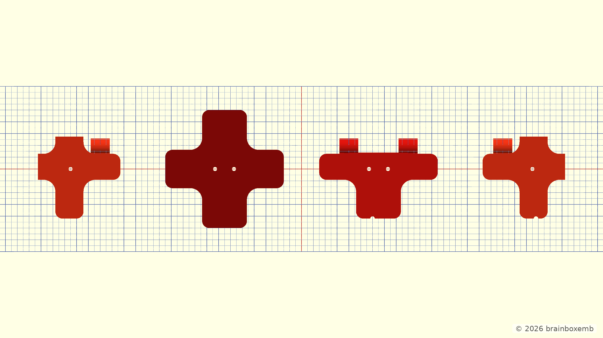
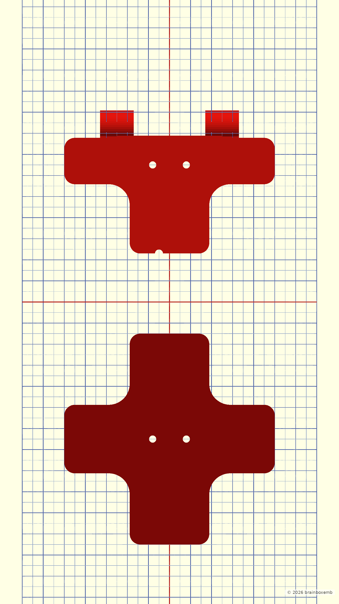
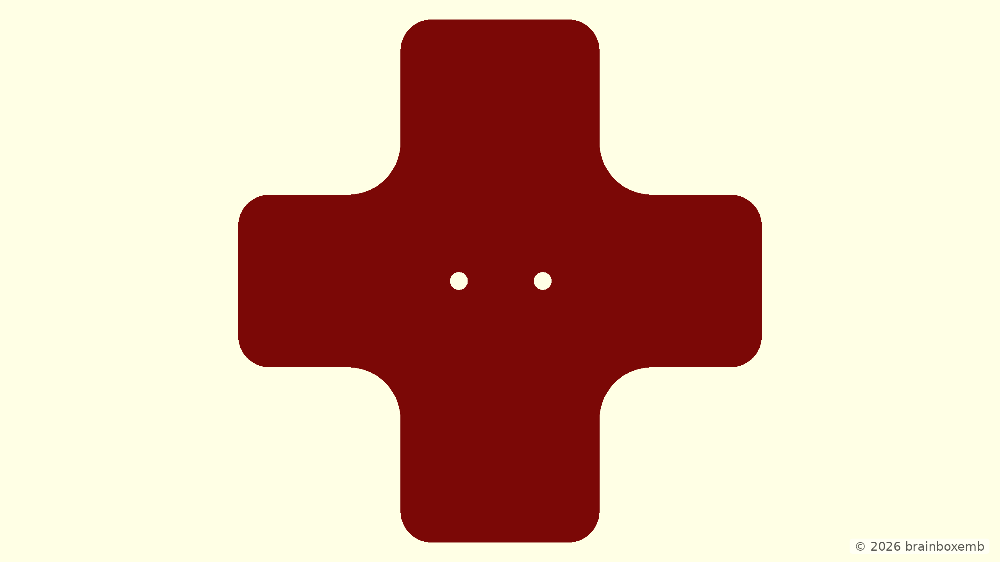
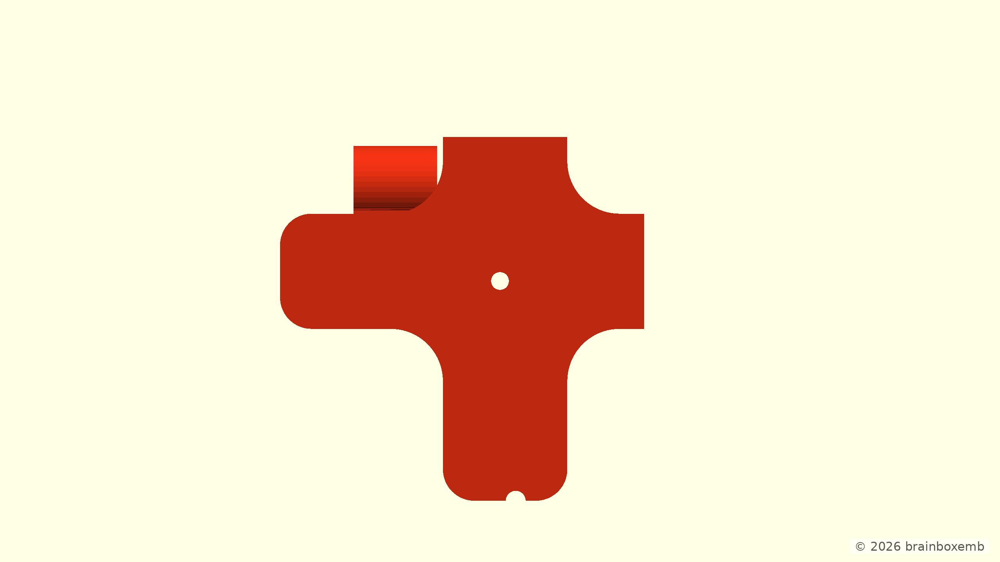
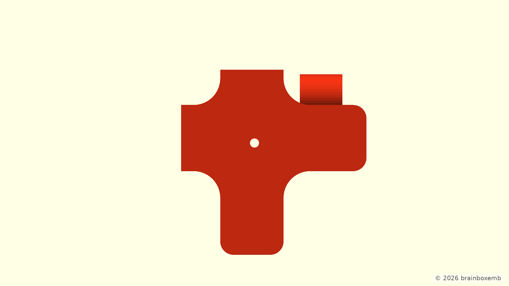

# Coupler profile — Large

> The model and documentation were developed with the assistance of ChatGPT.

## Profile preset values

These are the fixed values selected by the `large` profile. The same fields are editable when `custom` is selected in the OpenSCAD Customizer.

| Setting | Value |
|---|---:|
| Profile envelope | 100 × 100 mm |
| Wall thickness | 6 mm |
| Guide height | 10 mm |
| Base thickness | 4 mm |
| Corner radius | 10 mm |
| Edge radius | 5 mm |
| Tube clip offset | 25 mm |

## Derived guide geometry

These values are **calculated**, not independent profile settings. They are shown only to make the geometry easier to verify.

| Derived value | Formula | Result |
|---|---|---:|
| Start of plate edge radius | `profile_size / 2 - edge_radius` | 45 mm |
| Plate-follow depth | `wall_thickness × 0.30` | 1.8 mm |
| Own cap depth | `wall_thickness × 0.70` | 4.2 mm |
| Maximum guide reach | radius start + follow + cap | 51 mm |

## Side by side

## Stacked

## Middle panel coupler

## Horizontal edge panel coupler

## Left corner edge panel coupler

## Right corner edge panel coupler

