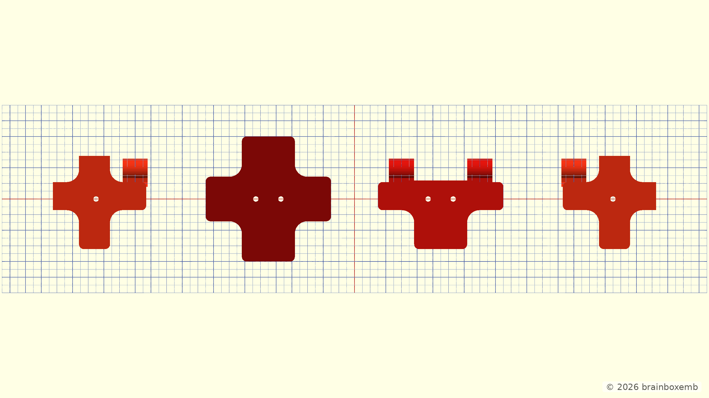
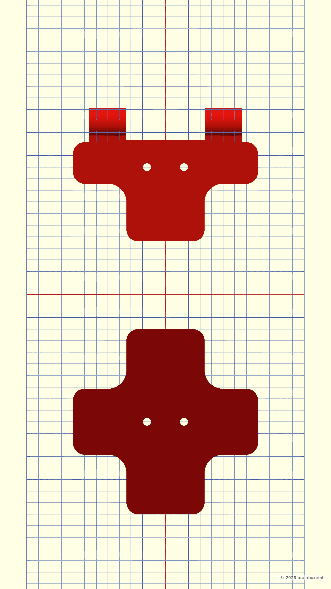

# Coupler profile — Medium

> The model and documentation were developed with the assistance of ChatGPT.

| Profile envelope | Wall thickness | Guide height | Base thickness | Corner radius | Edge radius | Guide length | Tube clip offset |
|---:|---:|---:|---:|---:|---:|---:|---:|
| 80 × 80 mm | 4 mm | 6 mm | 3 mm | 8 mm | 5 mm | 36 mm | 25 mm |

**Medium is the canonical V1.2 profile.** The normal full-display documentation renders and the complete display STL use this profile.

## Side by side

## Stacked

## Middle panel coupler

## Horizontal edge panel coupler

## Left corner edge panel coupler

## Right corner edge panel coupler

